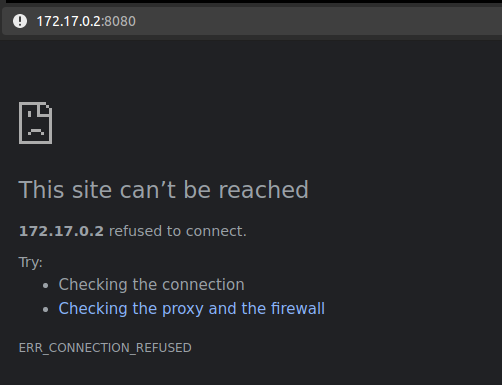
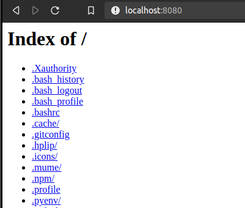
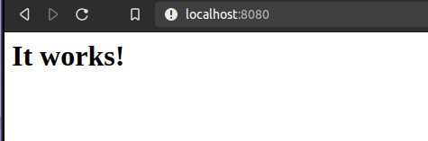
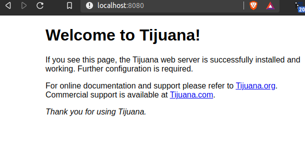

# Actividad 1

### Fundamentos de docker

## cli de docker

### Referencias

* Para resolver los ejercicios se recomienda seguir ladocumentación oficial de Docker.
* Adicionalmente tome como referencia los comandos básicos detallados a continuación. Serán utilizados a lo largo de la capacitación.

  * `docker run`

    Run a command in a new container

    ```text
      -a, --attach list        Attach to STDIN, STDOUT or STDERR      
      -c, --cpu-shares int     CPU shares (relative weight)
      -d, --detach             Run container in background 
      -e, --env list           Set environment variables
      -h, --hostname string    Container host name
      -i, --interactive        Keep STDIN open even if not attached
      -l, --label list         Set meta data on a container
      -m, --memory bytes       Memory limit
      -p, --publish list       Publish a container's port(s) to the host
      -P, --publish-all        Publish all exposed ports torandom ports
      -t, --tty                Allocate a pseudo-TTY
      -u, --user string        Username or UID (format:<name|uid>[:<group|gid>])
      -v, --volume list        Bind mount a volume
      -w, --workdir string     Working directory inside the container
    ```

  * `docker ps`

      List containers

    ```text
      -a, --all             Show all containers (default shows just running)
      -f, --filter filter   Filter output based on conditions provided
      -n, --last int        Show n last created containers (includes a states) (default -1)
      -l, --latest          Show the latest created container (includes all states)
      -q, --quiet           Only display container IDs
      -s, --size            Display total file sizes
    ```

  * `docker logs`
  * `docker image` Manage images

    ```text
         build       Build an image from a Dockerfile
         history     Show the history of an image
         import      Import the contents from a tarball to create a filesystem image
         inspect     Display detailed information on one or more images
         load        Load an image from a tar archive or STDIN
         ls          List images
         prune       Remove unused images
         pull        Pull an image or a repository from a registry
         push        Push an image or a repository to a registry
         rm          Remove one or more images
         save        Save one or more images to a tar archive (streamed to STDOUT by default)
         tag         Create a tag TARGET_IMAGE that refers to SOURCE_IMAGE
    ```

  * `docker start`
  * `docker stop`
  * `docker rm` Remove one or more containers

    ```bash
      -f, --force     Force the removal of a running container (uses SIGKILL)
      -l, --link      Remove the specified link
      -v, --volumes   Remove anonymous volumes associated with the container
    ```

  * `docker history`
  * `docker tag`
  * `docker restart`
  * `docker rmi`
  * `docker commit`
  * `docker exec`
  * `docker search`

* Nota: para ver las opciones de cada comando utilizar `–help`. Ejemplo: `docker comando –help`

### Ejercicios

1. Instalar Docker:
   * Realizar la instalación en su máquina siguiendo los pasos de acuerdo a su Sistema Operativo.

     ```text
      # GPG key:
      curl -fsSL https://download.docker.com/linux/ubuntu/gpg | sudo gpg --dearmor -o /usr/share/keyrings/docker-archive-keyring.gpg
      # Add repo:
      echo "deb [arch=amd64 signed-by=/usr/share/keyrings/docker-archive-keyring.gpg] https://download.docker.com/linux/ubuntu $(lsb_release -cs) stable" | sudo tee /etc/apt/sources.list.d/docker.list > /dev/null
      # Install
      sudo apt-get update
      sudo apt-get install docker-ce docker-ce-cli containerd.io
      # Para no usar sudo:
         # Crear grupo
         sudo groupadd docker
         # Añadir usuarios
         sudo usermod -aG docker $USER
         # Rfrescar permisos
         newgrp docker
     ```

**2.** Correr su primer aplicación con contenedores: “Hello World”

`docker run hello‑world`

* ¿Qué imagen se utiliza para instanciar el contenedor?

  Se utiliza la imagen "hello\_world" obtedida de Docker Hub.

* ¿Qué puede decir de los mensajes que se pueden ver en la consola? 

  Se puede ver que la instalación fue correcta.

**3.** Luego de correr el contenedor de la aplicación “Hello World” ¿Que sucede con el contenedor que se instanció? ¿Continúa existiendo? Utilize el comando `docker ps` y `docker ps ‑a`. 

Con la opción `-a` se muestran todos los contenedores, uno por cada vez que se ejecutó el comando `run`, en este caso tres veces. Con la opción por defecto se muestran los contenedores corriendo actualmente, en este caso ninguno.

```text
   $ docker ps -a
   CONTAINER ID   IMAGE         COMMAND    CREATED          STATUS                      PORTS     NAMES
   5bd9908d5667   hello-world   "/hello"   18 seconds ago   Exited (0) 7 seconds ago              condescending_wilbur
   3fe380dce5de   hello-world   "/hello"   13 minutes ago   Exited (0) 13 minutes ago             bold_brahmagupta
   b6e4d1c1ee94   hello-world   "/hello"   7 hours ago      Exited (0) 7 hours ago                bold_wilbur

   $ docker ps
   CONTAINER ID   IMAGE     COMMAND   CREATED   STATUS    PORTS     NAMES
```

4. Correr un nuevo contenedor basado en la imagen “ubuntu:18.04”

> `docker run ubuntu:18.04 /bin/bash`

* Utilizando `docker ps` ¿Qué sucedió con el estado del contenedor?

   Muestra el estado `Exited (0)`. Ha finalizado con código de salida `0`.

* Investigue el parámetro `‑i ‑t` del comando `docker run` 

  La opción `-i` significa modo interactivo. Se mantiene abierto STDIN y entonces se pueden enviar comandos a la imagen corriendo en el contenedor. Con `-t` se agrega una pseudo-tty, es decir una terminal, los comandos enviados tienen mas contexto, mostrandose un prompt. Sin `-i`, la opción `-t` no ejecuta los comandos introducidos.

* Instancie nuevamente un contenedor utilizando ahora `-i -t` \(o `-it`\)

  * ¿Qué otra información se puede obtener con el comando `docker ps`?

      Ahora se puede ver el contenedor corriendo

    ```bash
      $ docker ps
      CONTAINER ID   IMAGE          COMMAND       CREATED          STATUS          PORTS     NAMES
      c92db47c8cf6   ubuntu:18.04   "/bin/bash"   26 seconds ago   Up 22 seconds             pensive_benz
    ```

  * ¿Se le asigna alguna descripción/nombre al contenedor creado? ¿Cúal? 

    El nombre asignado es `pensive_benz`.

  * ¿Es posible asignar un nombre a un contenedor cuando es creado? ¿Con qué parámetros?

     Con el comando `docker create` o `docker run` con opción `--name`

    ```text
      $ docker create --help | grep "name "
          --domainname string              Container NIS domain name
      -h, --hostname string                Container host name
            --name string                    Assign a name to the container
      -u, --user string                    Username or UID (format: <name|uid>[:<group|gid>])

      $ docker create --name pepito ubuntu:18.04 /bin/bash
      8efd815e7d31c9edfc7c92bf78c682f60ee01f49d6916bb34196b18b2075ea43
    ```

    Se puede renombrar usando: `$ docker rename pensive_benz primera`. Se puede realizar mientras el contenedor está corriendo.


  * Cree otro contenedor con el nombre `capacitacion‑practica‑01`.
  * Listar los contenedores creados hasta el momento en su máquina y verificar que se acaba de crear un contenedor con el nombre asignado.

    ```bash
      $ docker create --name capacitacion-practica-1 ubuntu:18.04 /bin/bash
      9237fa2e568667a789a75935eecbdef92484e647afdf3b784a16bf222d68c69c

      $ docker ps -a
      CONTAINER ID   IMAGE          COMMAND       CREATED          STATUS                        PORTS     NAMES
      9237fa2e5686   ubuntu:18.04   "/bin/bash"   50 seconds ago   Created                                 capacitacion-practica-1
      d7e387e15e03   ubuntu:18.04   "/bin/bash"   5 minutes ago    Created                                 pepito
      8efd815e7d31   ubuntu:18.04   "/bin/bash"   7 minutes ago    Created                                 pepito2
      c92db47c8cf6   ubuntu:18.04   "/bin/bash"   17 minutes ago   Up 17 minutes                           primera
      37e34f3e0086   ubuntu:18.04   "/bin/bash"   25 minutes ago   Exited (130) 23 minutes ago             amazing_gates
      d4638377f26f   ubuntu:18.04   "/bin/bash"   27 minutes ago   Exited (0) 26 minutes ago               awesome_feistel
      eaef3b171776   hello-world    "/hello"      27 minutes ago   Exited (0) 27 minutes ago               recursing_lehmann
      11e31257348b   hello-world    "/hello"      27 minutes ago   Exited (0) 27 minutes ago               keen_archimedes
      0bc58837ca77   hello-world    "/hello"      27 minutes ago   Exited (0) 27 minutes ago               exciting_engelbart
      8d682510f090   hello-world    "-i"          27 minutes ago   Created                                 gallant_torvalds
      12faedb85d6d   ubuntu:18.04   "/bin/bash"   36 minutes ago   Exited (0) 36 minutes ago               objective_albattani
      5bd9908d5667   hello-world    "/hello"      44 minutes ago   Exited (0) 44 minutes ago               condescending_wilbur
      3fe380dce5de   hello-world    "/hello"      57 minutes ago   Exited (0) 57 minutes ago               bold_brahmagupta
      b6e4d1c1ee94   hello-world    "/hello"      7 hours ago      Exited (0) 7 hours ago                  bold_wilbur
    ```

5. ¿Con qué comando es posible eliminar un contenedor?

```text
docker rm –help
Remove one or more containers

-f, --force     Force the removal of a running container (uses SIGKILL)
-l, --link      Remove the specified link
-v, --volumes   Remove anonymous volumes associated with the container
```

* ¿Es posible eliminarlos mediante su identificador \(completo o parcial\) o con su nombre?

  Si, se puede eliminar usando nombre completo, o ID parcial, siempre y cuando la porción de id que se use sea única entre los containers locales.

  Para eliminar un contenedor que esta corriendo se usa `-f`.

  ```bash
   ~$ docker ps -a
   CONTAINER ID   IMAGE          COMMAND       CREATED             STATUS                         PORTS     NAMES
   9237fa2e5686   ubuntu:18.04   "/bin/bash"   10 minutes ago      Created                                  capacitacion-practica-1
   c92db47c8cf6   ubuntu:18.04   "/bin/bash"   27 minutes ago      Up 27 minutes                            primera
   37e34f3e0086   ubuntu:18.04   "/bin/bash"   35 minutes ago      Exited (130) 33 minutes ago              amazing_gates
   0bc58837ca77   hello-world    "/hello"      37 minutes ago      Exited (0) 37 minutes ago                exciting_engelbart
   3fe380dce5de   hello-world    "/hello"      About an hour ago   Exited (0) About an hour ago             bold_brahmagupta
   ~$ docker rm 3
   Error response from daemon: Multiple IDs found with provided prefix: 3
   ~$ docker rm 37
   37
   ~$ docker ps -a
   CONTAINER ID   IMAGE          COMMAND       CREATED             STATUS                         PORTS     NAMES
   9237fa2e5686   ubuntu:18.04   "/bin/bash"   11 minutes ago      Created                                  capacitacion-practica-1
   c92db47c8cf6   ubuntu:18.04   "/bin/bash"   28 minutes ago      Up 28 minutes                            primera
   0bc58837ca77   hello-world    "/hello"      38 minutes ago      Exited (0) 38 minutes ago                exciting_engelbart
   3fe380dce5de   hello-world    "/hello"      About an hour ago   Exited (0) About an hour ago             bold_brahmagupta
   ~$ docker rm bold
   Error: No such container: bold
   ~$ docker rm bold_brahmagupta 
   bold_brahmagupta
   ~$ docker ps -a
   CONTAINER ID   IMAGE          COMMAND       CREATED          STATUS                      PORTS     NAMES
   9237fa2e5686   ubuntu:18.04   "/bin/bash"   12 minutes ago   Created                               capacitacion-practica-1
   c92db47c8cf6   ubuntu:18.04   "/bin/bash"   28 minutes ago   Up 28 minutes                         primera
   0bc58837ca77   hello-world    "/hello"      38 minutes ago   Exited (0) 38 minutes ago             exciting_engelbart
   ~$ docker rm primera
   Error response from daemon: You cannot remove a running container c92db47c8cf69d438c44569b982a90476c78c17f3ea31dc4d302493f1a9b5ad2. Stop the container before attempting removal or force remove
   ~$ docker rm -f primera
   primera
   ~$ docker ps -a
   CONTAINER ID   IMAGE          COMMAND       CREATED          STATUS                      PORTS     NAMES
   9237fa2e5686   ubuntu:18.04   "/bin/bash"   12 minutes ago   Created                               capacitacion-practica-1
   0bc58837ca77   hello-world    "/hello"      39 minutes ago   Exited (0) 39 minutes ago             exciting_engelbart
  ```

**6.**  Luego de ejecutar un contenedor y éste finalice su ejecución, el mismo cambia su estado a detenido pero sigue existiendo.

* ¿Qué ventajas y desventajas cree que podría causar este comportamiento? 

  La principal ventaja es que se puede ver por qué un contenedor finalizo su ejecución, gracias al código de _exit_. Además puede ser útil iniciar un contenedor existente, que recuerde el estado de la ejecución anterior, las configuraciones y opciones adicionales aplicadas al crearlo. Por ejemplo si la aplicación en el contenedor tiene un proceso de inicialización muy costoso, esto es especialmente útil. Como desventaja, estos contenedores ocupan recursos, aunque solo espacio en el almacenamiento, ya que un contenedor detenido es solo metadatos, por lo que no hay costo de RAM o CPU.

* Investigue el comportamiento del parámetro `–rm` de `docker run`

  ```text
   ~$ docker run --help | grep "\-rm"
   --rm                             Automatically remove the container when it exits
  ```

**7.** Correr un servicio Apache

* Busque con el comando `docker search apache` el nombre de la imagen oficial.
* Correr un contenedor con la imagen oficial de apache. 

  `$ docker run -it httpd`

* Listar los contenedores que se están ejecutando. ¿Qué información relevante puede observar en la columna PORTS?

    Se puede observar el valor `80/tcp` en esa columna. En ella se muestran los puertos o rango de puertos expuestos o publicados y el protocolo utilizado. En este caso el puerto 80 con protocolo tcp del contenedor.

  ```text
    $ docker ps
    CONTAINER ID   IMAGE     COMMAND              CREATED              STATUS              PORTS     NAMES
    40a97db7a58e   httpd     "httpd-foreground"   About a minute ago   Up About a minute   80/tcp    distracted_gagarin
  ```

* ¿Es posible acceder por el navegador al servidor web iniciado en dicho puerto? De ser necesario, realice el mapeo de puertos adecuado para acceder al contenedor desde su propio navegador. Ayuda: `docker run ‑p`

  No es posible. Si bien el proceso está corriendo, los puertos del contenedor no son accesibles desde el host.

  

  Para mapear los puertos del contenedor al host se corre con la opción `-p`. Por ejemplo la opción `-p 8080:80`, mapea el puerto 80 del contenedor al puerto 8080 del host.

  * A veces sucede un error:

      `AH00094: Command line: 'httpd -D FOREGROUND'`

      `AH00492: caught SIGWINCH, shutting down gracefully`

  * También con el comando recomendado en Docker Hub:

    `docker run --name my-apache-app -p 8080:80 -v "$PWD":/usr/local/apache2/htdocs/ httpd:2.4`

  * Finalmente:

    `$ docker run -it -p 8080:80 -v "$PWD":/usr/local/apache2/htdocs/ httpd:2.4`

    

    ```text
      $ docker ps
      CONTAINER ID   IMAGE       COMMAND              CREATED         STATUS         PORTS                                   NAMES
      2d5da1f39a77   httpd:2.4   "httpd-foreground"   2 minutes ago   Up 2 minutes   0.0.0.0:8080->80/tcp, :::8080->80/tcp   vibrant_lehmann
    ```

* ¿Qué sucede si se cierra la consola en donde se encuentra corriendo el servidor web Apache? \(Ctrl+C\)

  > Chequear el estado del contenedor con el comando `docker ps` y `docker ps ‑a`.

  Al hacer eso el contenedor finaliza ya no se puede acceder a el servidor.

  ```text
    172.17.0.1 - - [22/Apr/2021:00:54:48 +0000] "GET / HTTP/1.1" 200 1605
    ^C[Thu Apr 22 00:59:48.881066 2021] [mpm_event:notice] [pid 1:tid 139798862738560] AH00491: caught SIGTERM, shutting down

    ~$ docker ps -a
    CONTAINER ID   IMAGE          COMMAND              CREATED          STATUS                      PORTS     NAMES
    2d5da1f39a77   httpd:2.4      "httpd-foreground"   5 minutes ago    Exited (0) 27 seconds ago             vibrant_lehmann
  ```

8. Volver a correr Apache utilizando Docker, en este oportunidad cuando cierre la consola el servidor web no debe detenerse. De esta manera cuando ejecute el comando `docker ps` , el estado del contenedor debe ser `Up` y debería continuar siendo accesible mediante el navegador.

* Investigue el parámetro `‑d` de `docker run`

   El comando sirve para ejecutar el contenedor en segundo plano, y poder seguir usando el terminal. Se puede acceder al servidor desde el navegador otra vez.

  ```text
   ~$ docker run -dit -p 8080:80 -v "$PWD":/usr/local/apache2/htdocs/ httpd:2.4
   b4b3113daad4f715314748c99c431848fffa51c1902bf80224a588781f043a9e
   ~$ docker ps -a
   CONTAINER ID   IMAGE          COMMAND              CREATED          STATUS                      PORTS                                   NAMES
   b4b3113daad4   httpd:2.4      "httpd-foreground"   6 seconds ago    Up 3 seconds                0.0.0.0:8080->80/tcp, :::8080->80/tcp   priceless_agnesi
  ```

**9.** Cuando se ejecuta un contenedor sin la opción _detached_ se pueden ver los logs de la aplicación desde la consola, teniendo el problema de que al cerrar la consola se detiene la ejecución del contenedor. Investigar como se podrían obtener los logs de un contenedor que se ejecuta como _detached_.

* Analice cómo ver las últimas 10 lineas de logs Se puede realizar conociendo el id del contenedor:

  > `docker logs --tail <cant> <container ID>`

  ```text
   $ docker logs --tail 10 b4b3
   [Thu Apr 22 01:02:39.106935 2021] [mpm_event:notice] [pid 1:tid 140413176231040] AH00489: Apache/2.4.46 (Unix) configured -- resuming normal operations
   [Thu Apr 22 01:02:39.107148 2021] [core:notice] [pid 1:tid 140413176231040] AH00094: Command line: 'httpd -D FOREGROUND'
   [Thu Apr 22 01:03:02.418828 2021] [core:error] [pid 9:tid 140413075711744] (13)Permission denied: [client 172.17.0.1:33002] AH00035: access to /.gnupg/index.html denied (filesystem path '/usr/local/apache2/htdocs/.gnupg/index.html') because search permissions are missing on a component of the path
   [Thu Apr 22 01:03:02.418992 2021] [core:error] [pid 9:tid 140413075711744] (13)Permission denied: [client 172.17.0.1:33002] AH00035: access to /.local/index.html denied (filesystem path '/usr/local/apache2/htdocs/.local/index.html') because search permissions are missing on a component of the path
   [Thu Apr 22 01:03:02.419103 2021] [core:error] [pid 9:tid 140413075711744] (13)Permission denied: [client 172.17.0.1:33002] AH00035: access to /.zoom/index.html denied (filesystem path '/usr/local/apache2/htdocs/.zoom/index.html') because search permissions are missing on a component of the path
   [Thu Apr 22 01:03:02.419710 2021] [core:error] [pid 9:tid 140413075711744] (13)Permission denied: [client 172.17.0.1:33002] AH00035: access to /.pki/index.html denied (filesystem path '/usr/local/apache2/htdocs/.pki/index.html') because search permissions are missing on a component of the path
   [Thu Apr 22 01:03:02.419818 2021] [core:error] [pid 9:tid 140413075711744] (13)Permission denied: [client 172.17.0.1:33002] AH00035: access to /.ssh/index.html denied (filesystem path '/usr/local/apache2/htdocs/.ssh/index.html') because search permissions are missing on a component of the path
   [Thu Apr 22 01:03:02.420087 2021] [core:error] [pid 9:tid 140413075711744] (13)Permission denied: [client 172.17.0.1:33002] AH00035: access to /.googleearth/index.html denied (filesystem path '/usr/local/apache2/htdocs/.googleearth/index.html') because search permissions are missing on a component of the path
   [Thu Apr 22 01:03:02.420185 2021] [core:error] [pid 9:tid 140413075711744] (13)Permission denied: [client 172.17.0.1:33002] AH00035: access to /.config/index.html denied (filesystem path '/usr/local/apache2/htdocs/.config/index.html') because search permissions are missing on a component of the path
   172.17.0.1 - - [22/Apr/2021:01:03:02 +0000] "GET / HTTP/1.1" 200 1605
  ```

* De qué forma ver los logs de hace 5 minutos hasta hace 4 minutos, es decir los logs de hace 5 minutos, durante un minuto.

  > `$ docker logs --since 5m --until 4m b4b3`

**10.** Cree una contenedor basado en alpine Linux. En él instale apache y cree una imagen usando `commit`.

> El paquete de apache es apache2 y para iniciar apache se utiliza `httpd -D FOREGROUND` para que inicie en foreground

```text
   ~$ docker run -it -p 8080:80 alpine
   Unable to find image 'alpine:latest' locally
   latest: Pulling from library/alpine
   540db60ca938: Pull complete 
   Digest: sha256:69e70a79f2d41ab5d637de98c1e0b055206ba40a8145e7bddb55ccc04e13cf8f
   Status: Downloaded newer image for alpine:latest
   / # ls
   bin    dev    etc    home   lib    media  mnt    opt    proc   root   run    sbin   srv    sys    tmp    usr    var
   / # apk add apache2
   fetch https://dl-cdn.alpinelinux.org/alpine/v3.13/main/x86_64/APKINDEX.tar.gz
   fetch https://dl-cdn.alpinelinux.org/alpine/v3.13/community/x86_64/APKINDEX.tar.gz
   (1/6) Installing libuuid (2.36.1-r1)
   (2/6) Installing apr (1.7.0-r0)
   (3/6) Installing expat (2.2.10-r1)
   (4/6) Installing apr-util (1.6.1-r7)
   (5/6) Installing pcre (8.44-r0)
   (6/6) Installing apache2 (2.4.46-r3)
   Executing apache2-2.4.46-r3.pre-install
   Executing busybox-1.32.1-r6.trigger
   OK: 9 MiB in 20 packages
   / # httpd -D FOREGROUND
   AH00558: httpd: Could not reliably determine the server's fully qualified domain name, using 172.17.0.2. Set the 'ServerName' directive globally to suppress this message
```



11. Inicie un contenedor de nginx. Luego utilice `docker exec` para ingresar al conentedor y modificar el index.html

```text
  docker exec [OPTIONS] CONTAINER COMMAND [ARG...]

  Run a command in a running container

  Options:
  -d, --detach               Detached mode: run command in the background
  --detach-keys string   Override the key sequence for detaching a container
  -e, --env list             Set environment variables
  --env-file list        Read in a file of environment variables
  -i, --interactive          Keep STDIN open even if not attached
  --privileged           Give extended privileges to the command
  -t, --tty                  Allocate a pseudo-TTY
  -u, --user string          Username or UID (format: <name|uid>[:<group|gid>])
  -w, --workdir string       Working directory inside the container
```

```text
  ~$ docker run -dit -p 8080:80 nginx
  Unable to find image 'nginx:latest' locally
  latest: Pulling from library/nginx
  f7ec5a41d630: Already exists 
  aa1efa14b3bf: Pull complete 
  b78b95af9b17: Pull complete 
  c7d6bca2b8dc: Pull complete 
  cf16cd8e71e0: Pull complete 
  0241c68333ef: Pull complete 
  Digest: sha256:75a55d33ecc73c2a242450a9f1cc858499d468f077ea942867e662c247b5e412
  Status: Downloaded newer image for nginx:latest
  ab22d5bcccae65acfd6f9d10de0567684168d0dd56de0be36ffd0eb2960f4f28

  ~$ docker exec -it ab22 /bin/bash
  root@ab22d5bcccae:/# find / -name "index.html"
  /usr/share/nginx/html/index.html
  find: '/proc/32/map_files': Permission denied
  root@ab22d5bcccae:/# sed -i 's/nginx/Tijuana/g' /usr/share/nginx/html/index.html 
  root@ab22d5bcccae:/#
```



**12.** Indique la diferencia entre las políticas de reinicio disponibles para un contenedor.

Para establecer la política de reinicio de un contenedor se puede usar el flag `--restart` del comando `docker run`. El valor de este flag puede ser:

| Flag | Descripción |
| :--- | :--- |
| `no` | \(por defecto\) No reiniciar automáticamente. |
| `on-failure` | Reiniciar solo si finalizo debido a un error \(`exit code != 0`\). |
| `always` | Reiniciar siempre que se finaliza. Si fue detenido manualmente, se reinicia cuando el _daemon_ de Docker o el contenedor son reiniciados manualmente. Esto es para prevenir bucles de reinicio. |
| `unless-stopped` | Reiniciar siempre que se finaliza, a menos que se lo detenga manualmente. No se reinicia aunque se reinicie el _daemon_. |

### Entregables

Los ejercicios a entregar son 2, 3, 6, 7, 9, 10, 12. Las entregas deben responder a las preguntas de cada ejercicio o los comandos usados para completarlo.

